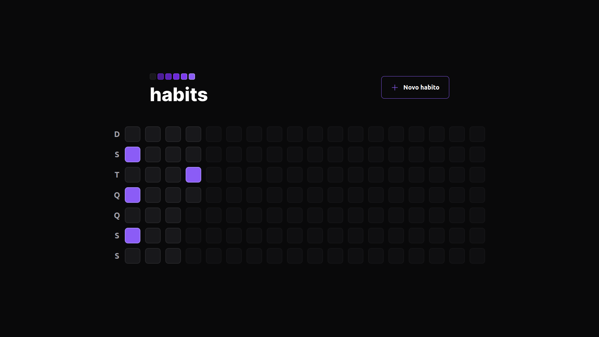
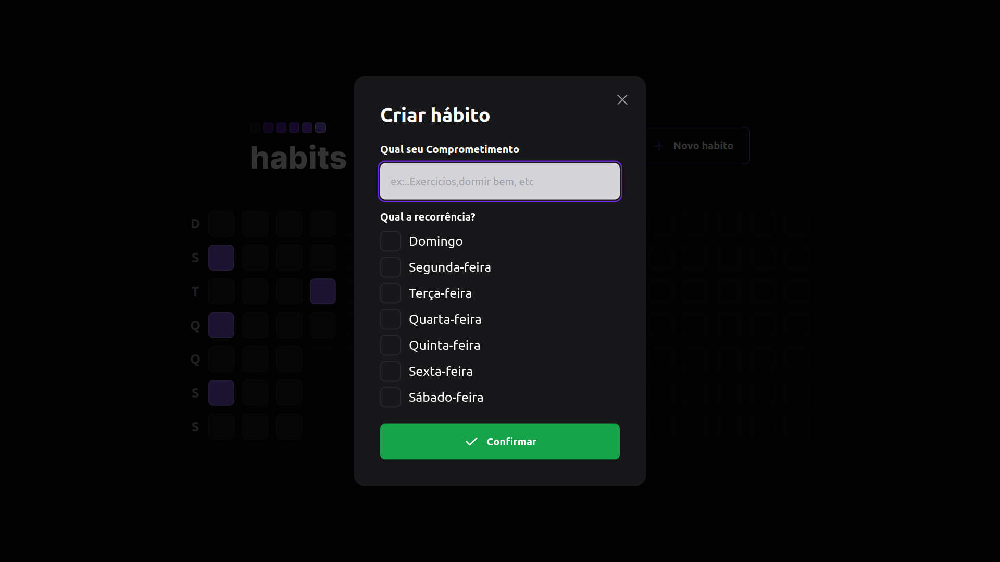

<h1 align="center"> NLW Setup </h1>

Evento exclusivo e gratuito, promovido pela Rocketseat para ensino.

<h1 align="center">
    
    
</h1>

  <a href="#-tecnologias">Tecnologias</a>&nbsp;&nbsp;&nbsp;|&nbsp;&nbsp;&nbsp;
  <a href="#-projeto">Projeto</a>&nbsp;&nbsp;&nbsp;|&nbsp;&nbsp;&nbsp;
  <a href="#-layout">Layout</a>&nbsp;&nbsp;&nbsp;|&nbsp;&nbsp;&nbsp;
  <a href="#memo-licença">Licença</a>

  

 

## 🚀 Tecnologias

Esse projeto foi desenvolvido com as seguintes tecnologias:

- [Node](https://nodejs.org/en/)
- [React](https://reactjs.org)
- [TypeScript](https://www.typescriptlang.org/)
- [Fastify](https://www.fastify.io/)
- [Prisma](https://www.prisma.io/)
- [Tailwindcss](https://tailwindcss.com/)
- [Vite](https://vitejs.dev/)
- [Radix UI](https://www.radix-ui.com/)

## 💻 Projeto

Projeto criado no evento Nlw-setup ajudar você a rastrear seus hábitos e melhorar sua qualidade de vida. Com ele, você pode criar uma lista de hábitos que deseja incorporar em sua rotina diária e marcá-los a medida que os pratica.

O aplicativo apresenta um quadro diário que mostra a frequência dos hábitos praticados, permitindo que você veja sua progresso ao longo do tempo e se motive a seguir em frente.

Para rodar clone o repositório  `git clone https://github.com/DouglasO-R/Nlw-setup-habits.git`, acesse a pasta do web `cd web`, instale as dependências `yarn`, e rode o app com `yarn dev` 

## 🔖 Layout

Nos links abaixo você encontra o layout do projeto web e também do mobile. Lembrando que você precisa ter uma conta no [Figma](http://figma.com/) para acessá-lo.

- [Layout Web/Mobile](https://www.figma.com/community/file/1195326661124171197)

## :memo: Licença

Esse projeto está sob a licença MIT.

